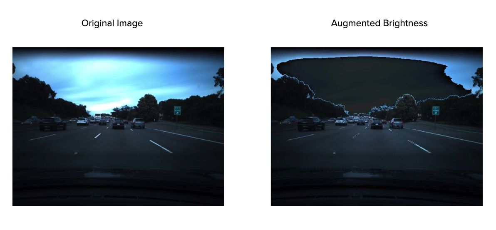
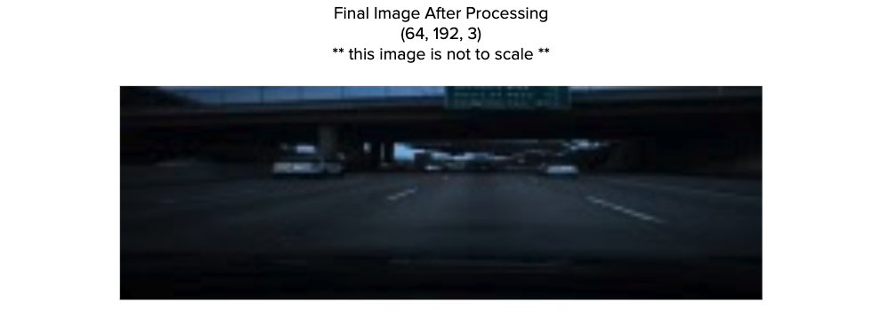
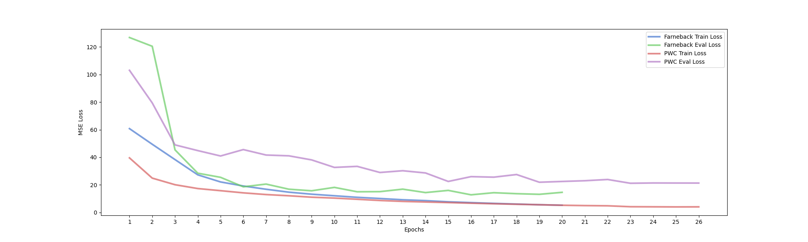

# Voof

  

  Speeds for this GIF generated using Method #1 ([Full video](https://www.youtube.com/watch?v=ef5jz3NAdp8))

## Overview
A series of experiments attempting to predict vehicle speed from dash cam videos using optical flow and neural networks. Voof is short for video odometry using optical flow. A more thorough write-up can be found in this [blog](#) post.

## Methods
### Data
There is a dashcam video `/data/train/train.mp4` that is accompanied by a text file `/data/train/train.txt` that contains the ground truth speed at each frame. I also managed to acquire a second video `/data/train/test.mp4` along with `/data/train/test.txt` containing the ground truth speed at each frame. The test video is used to see how well the methods demonstrated can generalize. The train video comes from the [comma.ai speed challenge](https://github.com/commaai/speedchallenge), the test video also comes from comma.ai.

### Optical Flow
[Optical flow](https://en.wikipedia.org/wiki/Optical_flow) quantifies the apparent motion of objects between frames. Optical flow can also be defined as the distribution of apparent velocities of movement of brightness patterns in an image. Calculating the relative velocity of the vehicle directly from an optical flow field requires [depth](https://www.youtube.com/watch?v=OB8RncJWIqc) (this was not obviously apparent to me at first). In our case the only way to estimate depth would be to use another neural network, which is not a method I chose to explore (although I believe that it may hold promise in terms of generalization).

### Image Preprocessing
With optical flow estimation in mind, the saturation of each pair of frames was augmented with the same uniform random variable to account for illumination changes that will severely deteriorate performance. The majority of the sky and car hood are then cropped since they do not really change between successive frames. The frames are then resized and interpolated to work with the CNN architecture. The image preprocessing remains the same for all methods used.

  

  

### Method #1: Gunnar-Farneback Dense Optical Flow
Gunnar-Farnebeck is an optimization based method for estimating dense optical flow. Two successive frames are preprocessed and fed into the algorithm. The resulting two-dimensional optical flow field can then be turned into a 3 channel RGB image via the following [method](https://opencv-python-tutroals.readthedocs.io/en/latest/py_tutorials/py_video/py_lucas_kanade/py_lucas_kanade.html).
This process is repeated for each pair of successive frames. The resulting RGB optical flow images are accompanied by their appropriate ground truth speeds and saved as a PyTorch dataset. All of the code for this can be found in `preprocess_farneback.py`.

### Method #2: PWC-Net Dense Optical Flow
Optical flow has historically been an optimization problem, however neural networks have been shown to work [better](https://arxiv.org/pdf/1612.01925.pdf) under certain conditions. I modified this [PWC-Net implementation](https://github.com/NVlabs/PWC-Net/tree/master/PyTorch) to work with modern PyTorch. I used the model, provided by the original authors, that was pre trained on the [MPI Sintel](http://sintel.is.tue.mpg.de/) dataset. The procedure is similar to that of Method #1, however the optical flow field is left in two-dimensions, since the output of PWC-Net is slightly different compared to that of Gunnar-Farneback. All of the code for this can be found in `preprocess_pwc.py`.

### CNN Architecture
Once we have optical flow, we can then attempt to train a convolutional neural network to predict speed. Note that this is a regression task not a classification task (although it would be interesting to explore this problem as such). The CNN architecture is from the [End-to-End Deep Learning for Self-Driving Cars](https://developer.nvidia.com/blog/deep-learning-self-driving-cars/) blog post by NVIDIA.

  

## Training/Analysis
The models for both methods were trained in a very similar fashion. With 80% of the data reserved for training and 20% of the data for evaluation. It is important to note that the data was not randomly shuffled, since this does not preserve integrity between the training and evaluation sets.

It turns out that these method works fairly well on the evaluation sets but do not generalize very well. I go more into depth on why I believe this occurs, as well as some of the other caveats in my [blog post](#).

  

## Previous Work
* https://github.com/ryanchesler/comma-speed-challenge
* https://github.com/jovsa/speed-challenge-2017
* https://github.com/JonathanCMitchell/speedChallenge

## Contact

For questions/general discussion DM me on twitter.
